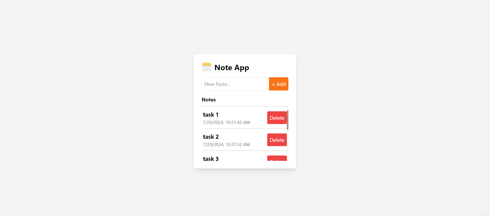

# Todo-App App:

## Introduction
Create a Todo App using WebSockets (Native or Socket.io) and HTTP, that creates a basic to-do list The application should use ReactJS, Redux, React Router, and Axios for frontend development, and
Node with Express Framework for backend API development. The data should be
stored in MongoDB Server. The entire application should be containerized and
deployable.

## Requirements:
  o Add new items to the list by sending a message with add event to the WS Server 
  o Store the items as a stringified Array in a Redis Cache with a single key called FULLSTACK_TASK_<YOUR_FIRST_NAME> 
  o If there are more than 50 items in the cache, move them to a MongoDB Collection and flush them    from the Cache. 
  o Retrieve all items in the list through /fetchAllTasks endpoint of a HTTP API 

## Project Type
Frontend and Backend

## Deployed App
Frontend: [Live Demo](https://fullstack-task-sravani.vercel.app/)
Backend: [Live Demo](https://fullstack-task-sravani-backend-app.onrender.com/)

## Features
**Responsive Layout:** The layout is optimized for both mobile and desktop views, ensuring a seamless user experience across devices.

**Feature Implementation:** 
   - The application features a responsive and visually list of todo-list.
   - Create a todo and click on add button it will stored in redis and if todo list more than 50 list then it will be stored in mongodb.
   - Display the todo list along with delete functionality.
   - It was Responsive

Backend:
1. Test the API's in Postman:

**Auth API's**

| Methods | API URL                                                                    |
|---------|----------------------------------------------------------------------------|
|  GET    | https://fullstack-task-sravani-backend-app.onrender.com/fetchAllTasks      |

2. connect with Mongodb altas
3. create the model to manage the database

    
## Design Decisions or Assumptions

## Installation & Getting Started
To run the project locally, follow these steps:

### Clone the repository

    git clone https://github.com/Sravani0410/fullstack_task_Sravani.git
    

### Navigate to the project directory

    Frontend:cd backend
    Backend: cd frontend

### Install dependencies
 
   Frontend and Backend: npm install 

### Start the application

   Frontend: npm start
   Backend:npm start

## Usage

## Technology Stack

**Frontend:** Typescript,React,Redux-toolkit

**CSS:** Implement CSS 

**Backend:** Node,Express,Redis

**MongoDB Atlas:** To store the data in global cloud-based database service designed for developing modern applications.

**Deployment:** 
   Backend :   vercel,
   Frontend :  vercel
---
